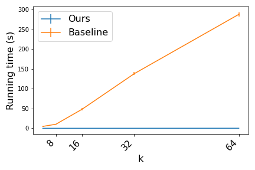
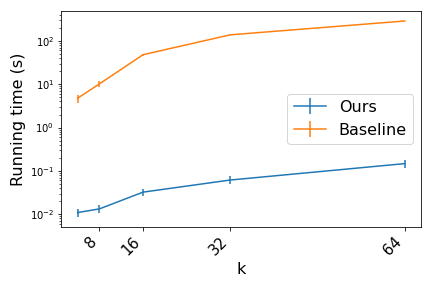
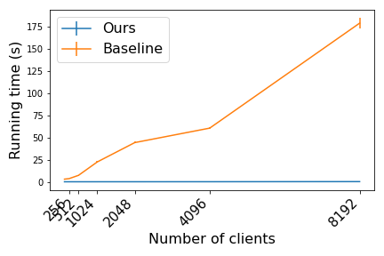
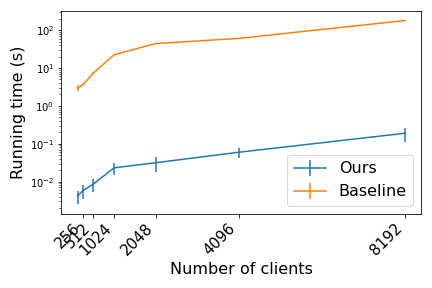
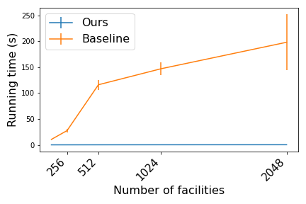
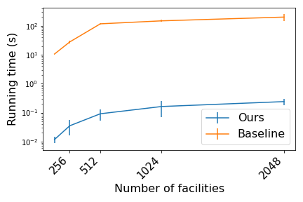

# fast-kmedian
An efficient implementation of a local-search algorithm for k-median.

The algorithm can be found in ``local_search.ls_kmedian``. The function takes as input a pre-computed matrix of facility-client distances and the number of facilities to be chosen ($k$).

A baseline implementation is in ``baseline.py``.

## Description

A naive implementation of local search for k-median will involve several loops, which can be very inefficient in Python.

Here we offer an implementation that **avoids loops almost entirely**, by using matrix operations to compute clustering costs and select facilities.

It is not difficult to devise some matrix operations to achieve significant speed-ups (see ``prototype.py``). Some further numpy-fu takes us comfortably to the **1000x speed-up** realm.

Some experimental results below. Settings:
- 100 facilities, 1000 cients, varying $k$;
- 100 facilities, varying cients, $k=10$;
- varying facilities, 1000 cients, $k=10$.

Running times averaged over 10 runs.

Linear scale             |  log scale
:-------------------------:|:-------------------------:
  |  
  |  
  |  
